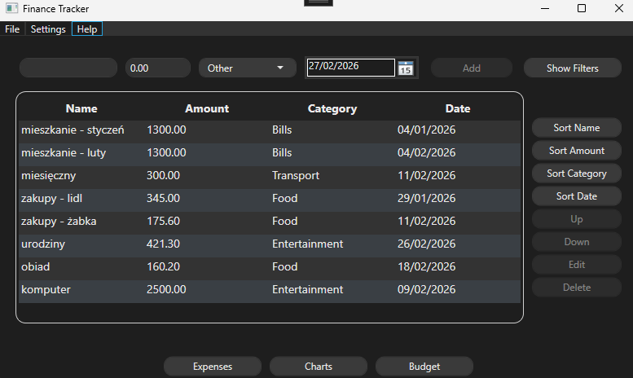
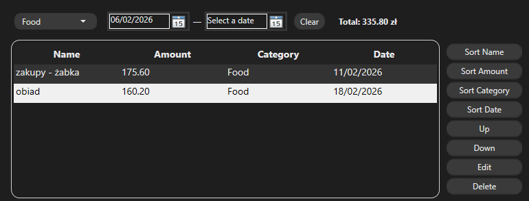
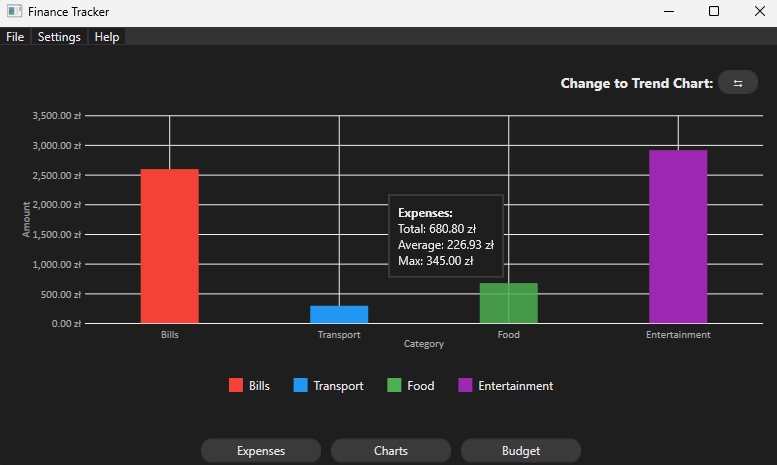
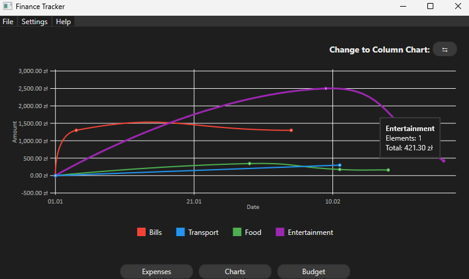
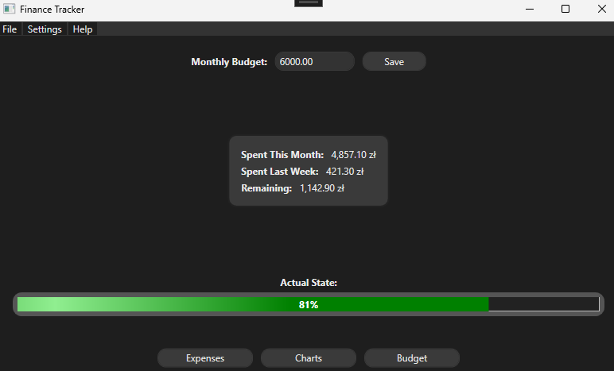
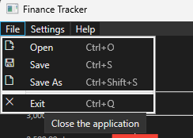
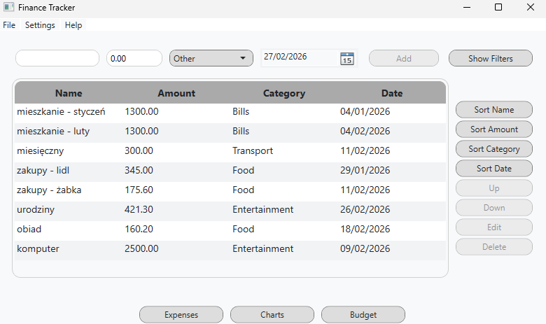
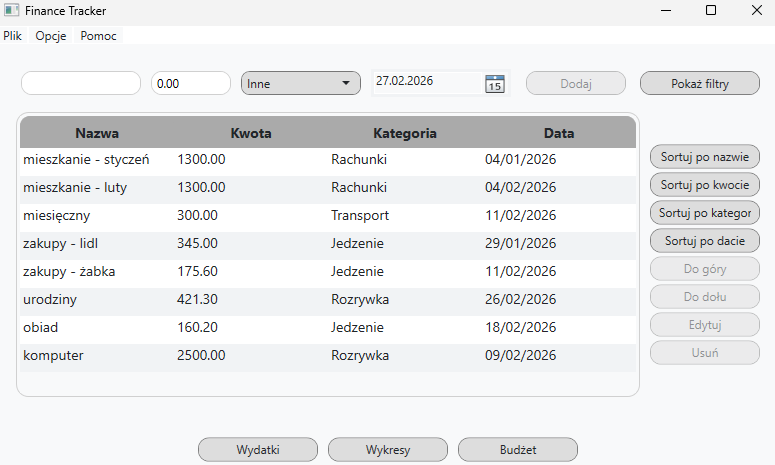

# Finance Tracker Application

A modern desktop application for managing personal expenses, built with **.NET 8**, **WPF**, and **MVVM** pattern. The application provides a full-featured experience including expense management, charts, budgets, CSV import/export, and customizable themes.

---

## Table of Contents

1. [Overview](#overview) 
2. [Project Highlights](#project-highlights)
3. [Features](#features) 
4. [Architecture](#architecture)  
5. [Technologies](#technologies)  
6. [Getting Started](#getting-started)
7. [Published Application](#published-application)
8. [Usage](#usage)  
9. [Screenshots](#screenshots)  
10. [Notes](#notes)

---

## Overview

**Finance Tracker** helps users monitor their expenses efficiently. The application follows the MVVM pattern and focuses on clean architecture, responsiveness, and usability.

The main functionalities include:

- Adding and editing expenses
- Filtering and sorting
- Monthly budget tracking with notifications
- Dynamic chart visualization
- CSV import/export
- Theme and language customization

---

## Project Highlights

- Clean and maintainable **MVVM architecture**
- Proper separation of concerns (ViewModels do not access EF Core directly)
- Dependency Injection configured at application startup
- Centralized error handling strategy
- Persistent user settings (theme, language, budget)
- Scalable service layer abstraction
- Strong UI/UX focus with responsive feedback and visual indicators
- Designed with real-world desktop application standards in mind

---

## Features

| Module                  | Description                                                                 |
|-------------------------|-----------------------------------------------------------------------------|
| **Expenses Management**  | Add, edit, delete expenses with validation and dynamic total calculations. |
| **Filtering & Sorting**  | Filter expenses by category, month, or date range. Sort by name, amount, category, or date. |
| **Database**             | Persistent storage using **SQLite** with EF Core. Automatic migrations and robust error handling. |
| **Charts**               | Animated charts by category and trends with tooltips, max/average indicators, and color-coded categories. |
| **Budget**               | Monthly budget tracking with visual warnings when limits are exceeded. Tooltip shows remaining amount. |
| **CSV Export/Import**    | Load and save expense data with proper error handling for invalid files. |
| **Themes & Localization**| Switch between light/dark themes and English/Polish languages. Settings persist between sessions. |
| **UI Polishing**         | Rounded corners, hover/fade effects, color accents, tooltips, icons, and consistent font styling. |

---

## Architecture

The application follows the **MVVM pattern**:

- **Views** – XAML UI layer responsible for user interaction  
- **ViewModels** – Commands, state management, and presentation logic  
- **Models** – Database entities and business data  

Core components:

- **BaseViewModel** – Implements `INotifyPropertyChanged`  
- **RelayCommand** – Encapsulates `ICommand`  
- **Service Layer** – Handles data access, messaging, CSV, charts, and budgets  
- **Dependency Injection** – Configured in `App.xaml.cs`

---

## Technologies

- **.NET 8**  
- **Visual Studio 2022**  
- **WPF / XAML**  
- **EF Core + SQLite**  
- **LiveCharts** (for animated charts)  
- **MVVM Pattern**  
- **Dependency Injection**  
- **Localization / Themes**  

---

## Getting Started

**Prerequisites:**

- .NET 8 SDK

- Visual Studio 2022 (recommended)

- Windows OS (WPF requirement)

**Clone the repository:**
```
git clone https://github.com/Zorquan04/finance-tracker.git
cd finance-tracker/FinanceTracker
```
**Database Setup:**

- The application uses SQLite + EF Core.

- On first run, the database is automatically created if it does not exist.

- If migrations need to be applied manually:

```
dotnet ef database update
```

**Run the application:**

```
dotnet run
```

---

## Published Application

A ready-to-run version of the application is available in the `/app` folder.

This build was published as a **self-contained Windows x64 executable**, 
so no additional .NET installation is required.

### How to run:

1. Navigate to the `/app` folder
2. Open the `FinanceTracker.exe` file
3. The application will automatically create the SQLite database on first run (if it does not exist)

---

## Usage

1. **Expenses**: Add new expenses using the form. Use **TwoWay binding** to update UI instantly.  
2. **Filters**: Toggle filters to refine visible expenses by category or date range.  
3. **Sorting**: Sort the table dynamically by clicking column headers or using menu commands.  
4. **Charts**: Switch between category-based column charts and trend line charts.  
5. **Budget**: Set a monthly limit and get visual notifications when exceeded.  
6. **CSV**: Import/export expense data. The application handles invalid formats gracefully.  
7. **Themes & Language**: Change theme or language via menu, requiring a restart for persistence.  

**Pro Tip:** Editing an expense changes the **Add** button to **Save**, and provides a **Cancel** option to discard changes.

---

## Screenshots

**Main Menu:**  


---

**Adding expense:**  


---

**Filtering:**  


---

**Sorting options:**  


---

**Column chart:**  


---

**Trend chart:**  


---

**Adjusting budget:**  


---

**Menu bar options:**  


---

**Modifying theme:**  


---

**Modifying language:**  


---

## Notes

- Database file is created automatically in the application directory
- Designed with scalability in mind for future feature expansion

---

**Author:** Kacper Gumulak - [Zorquan04](https://github.com/Zorquan04)  
**GitHub:** [Finance Tracker Repository](https://github.com/Zorquan04/finance-tracker)